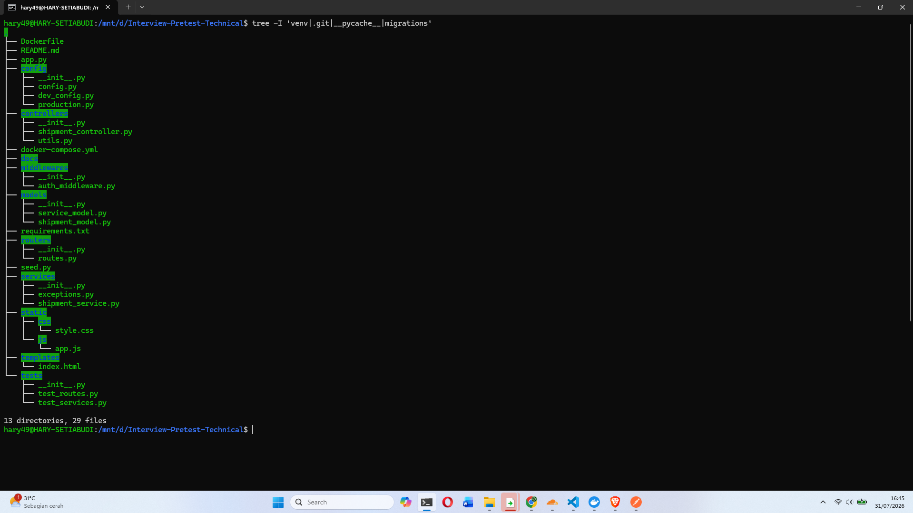
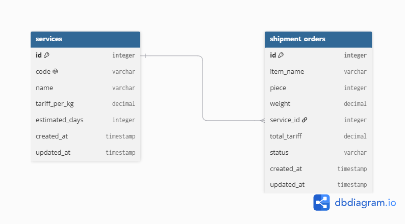
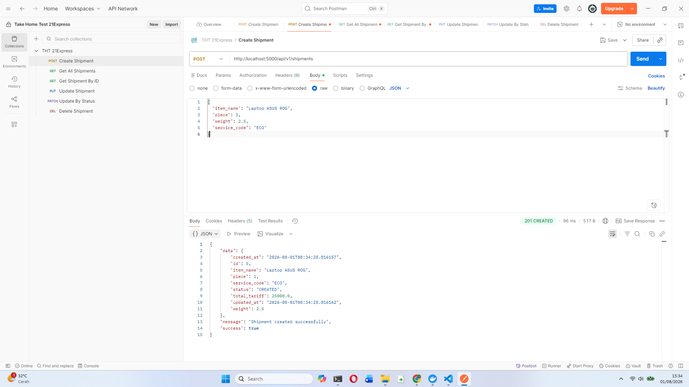
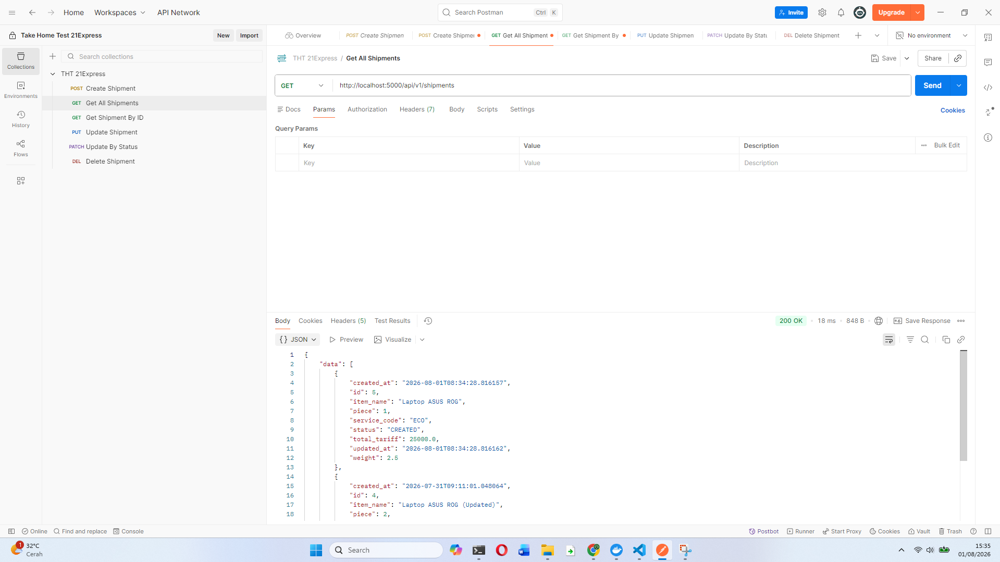
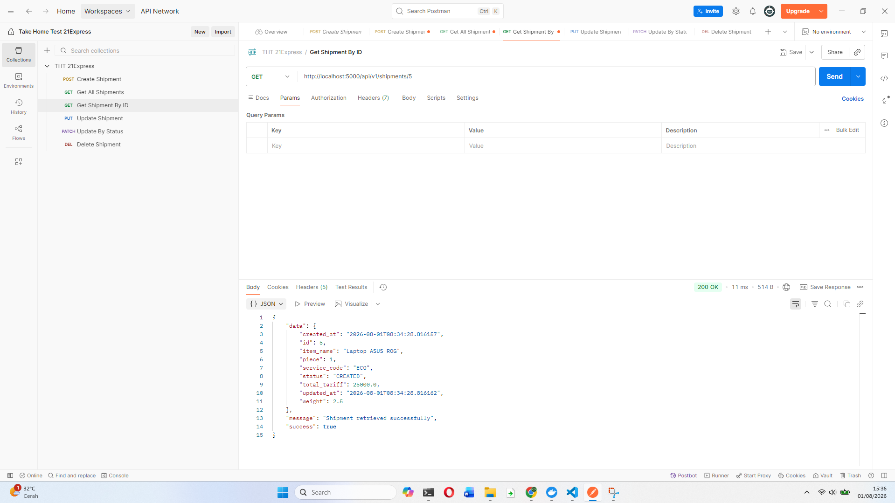
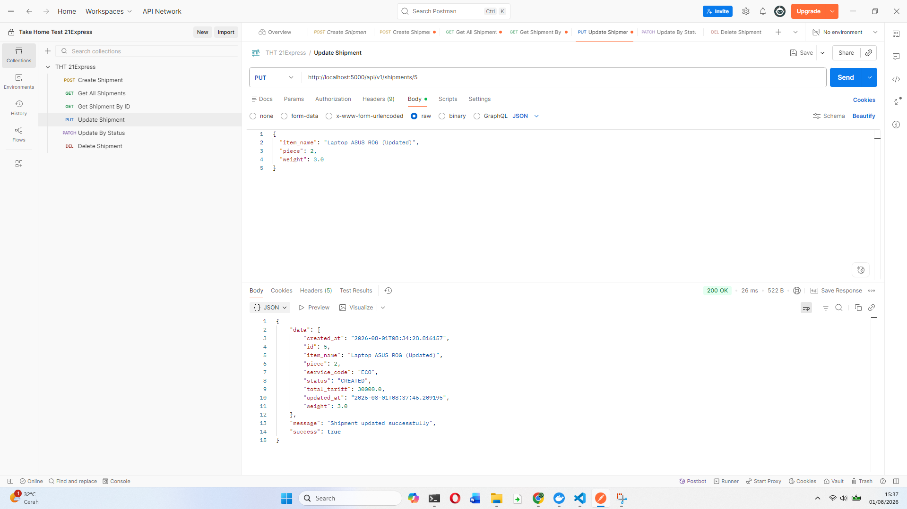
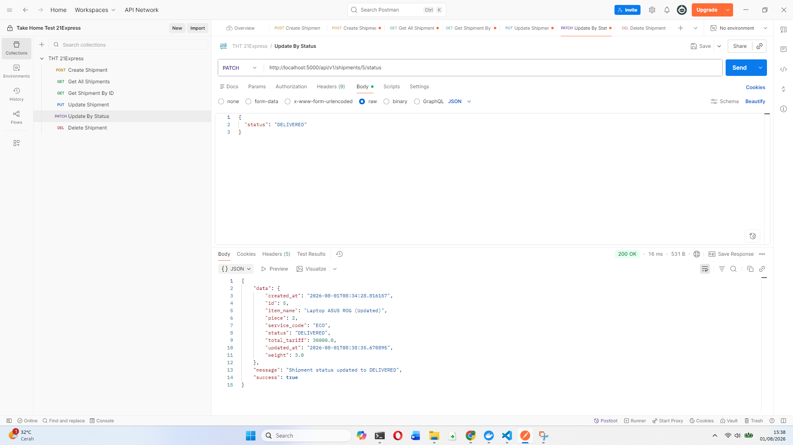
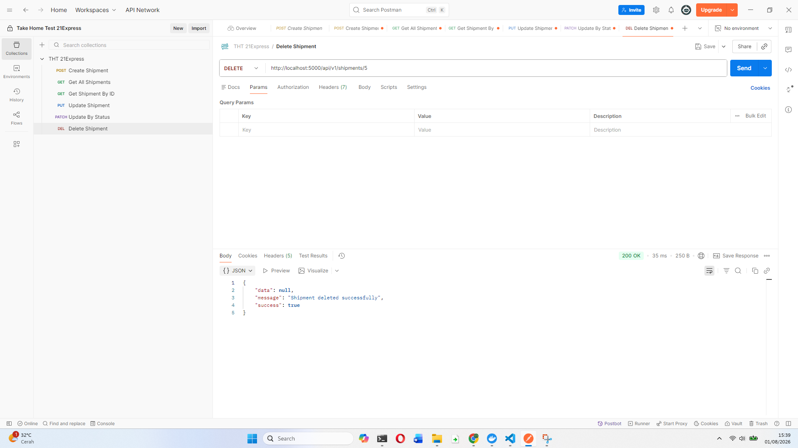

# Shipment Order API

Sistem ini dibuat untuk technical test **21 Express Backend Engineer**.

---

## Tech Stack

Komponen dan Teknologi

Language : Python
Framework : Flask
ORM : Flask-SQLAlchemy
Migration : Flask-Migrate
Database : PostgreSQL 16
Containerization : Docker & Docker Compose

---

## Struktur Folder

<p align="center">
  
</p>

**Alur request:**

- **Router** — Memetakan URL & HTTP method ke fungsi controller
- **Controller** — menerima request, memanggil service, mengembalikan response
- **Service** — menangani business logic
- **Model** — representasi struktur data/tabel

---

## Entity Relationship Diagram (ERD)

<p align="center">
  
</p>

Link ERD : https://dbdiagram.io/d/Pretest-6a6aea62c3a90dd98de87393

### Jenis Servis (Seed Data)

| Kode | Nama              | Tarif/kg  | Estimasi       |
| ---- | ----------------- | --------- | -------------- |
| ECO  | Economy           | Rp 10.000 | 3 hari         |
| ONS  | One Night Service | Rp 12.000 | 2 hari         |
| SDS  | Same Day Service  | Rp 20.000 | Hari yang sama |

---

## Cara Setup & Menjalankan Project

### Prasyarat

- [Docker Desktop](https://www.docker.com/products/docker-desktop/) sudah terinstall dan berjalan

### 1. Clone repository

```bash
git clone https://github.com/harystbd05/technical-test-21express.git
cd Interview-Pretest-Technical
```

### 2. Buat file `.env`

Isi `.env`:

```env
DB_USER=shipment_user
DB_PASSWORD=shipment_password
DB_NAME=shipment_db
DATABASE_URL=postgresql://shipment_user:shipment_password@db:5432/shipment_db
FLASK_ENV=development
SECRET_KEY=SECRET123
```

### 3. Build & jalankan container

```bash
docker-compose up --build -d
```

Cek container sudah berjalan:

```bash
docker-compose ps
```

### 4. Jalankan migration (membuat tabel di database)

```bash
docker-compose exec web flask db init
docker-compose exec web flask db migrate -m "initial migration"
docker-compose exec web flask db upgrade
```

### 5. Seed data jenis servis (ECO/ONS/SDS)

```bash
docker-compose exec web python seed.py
```

### 6. Akses API aplikasi

| Endpoint                                 | Deskripsi     |
| ---------------------------------------- | ------------- |
| `http://localhost:5000/api/v1/shipments` | REST API resi |
| `http://localhost:5000/dashboard`        | Web Dashboard |

---

## Dokumentasi API

```json
{
  "success": true,
  "message": "Deskripsi hasil",
  "data": {}
}
```

### 1. Create Shipment Order

```
POST /api/v1/shipments
Content-Type: application/json
```

**Request Body:**

```json
{
  "item_name": "Laptop ASUS ROG",
  "piece": 1,
  "weight": 2.5,
  "service_code": "ECO"
}
```

**Response `201 Created`:**

```json
{
  "success": true,
  "message": "Shipment created successfully",
  "data": {
    "id": 1,
    "item_name": "Laptop ASUS ROG",
    "piece": 1,
    "weight": 2.5,
    "service_code": "ECO",
    "total_tariff": 25000.0,
    "status": "CREATED",
    "created_at": "2026-07-31T09:11:01.048064",
    "updated_at": "2026-07-31T09:11:01.048121"
  }
}
```

---

### 2. Get All Shipment Orders

```
GET /api/v1/shipments
```

**Response `200 OK`:**

```json
{
  "success": true,
  "message": "Shipments retrieved successfully",
  "data": [{ "id": 1, "item_name": "Laptop ASUS ROG", "...": "..." }]
}
```

---

### 3. Get Shipment Order by ID

```
GET /api/v1/shipments/<id>
```

**Response `200 OK`** — data resi sesuai id.
**Response `404 Not Found`** — jika id tidak ditemukan.

---

### 4. Update Shipment Order

```
PUT /api/v1/shipments/<id>
Content-Type: application/json
```

**Request Body**

```json
{
  "item_name": "Laptop ASUS ROG",
  "piece": 2,
  "weight": 3.0
}
```

> `total_tariff` otomatis dihitung ulang jika `weight` atau `service_code` berubah.
> Resi dengan status `DELIVERED` tidak dapat diupdate.

---

### 5. Update Shipment Status

```
PATCH /api/v1/shipments/<id>/status
Content-Type: application/json
```

**Request Body:**

```json
{
  "status": "DELIVERED"
}
```

---

### 6. Delete Shipment Order

```
DELETE /api/v1/shipments/<id>
```

**Response `200 OK`:**

```json
{
  "success": true,
  "message": "Shipment deleted successfully",
  "data": null
}
```

---

## Bukti Testing API via Postman

Berikut hasil pengujian seluruh endpoint menggunakan Postman:

### Create Shipment

<p align="center">
  
</p>

### Get All Shipments

<p align="center">
  
</p>

### Get Shipments By ID

<p align="center">
  
</p>

### Update Shipment

<p align="center">
  
</p>

### Update Status to DELIVERED

<p align="center">
  
</p>

### Delete Shipment

<p align="center">
  
</p>

## Author

Dikerjakan oleh **[Hary Setiabudi,S.Kom]** untuk keperluan technical test 21 Express Backend Engineer.
